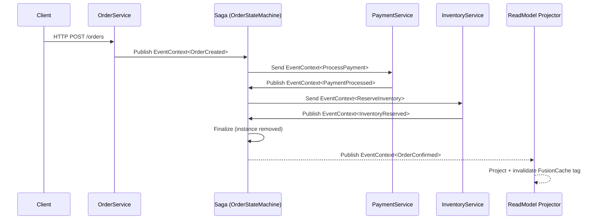
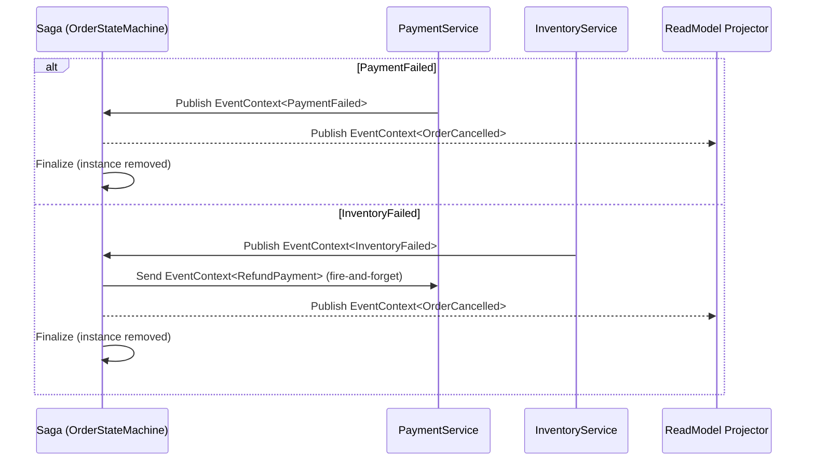
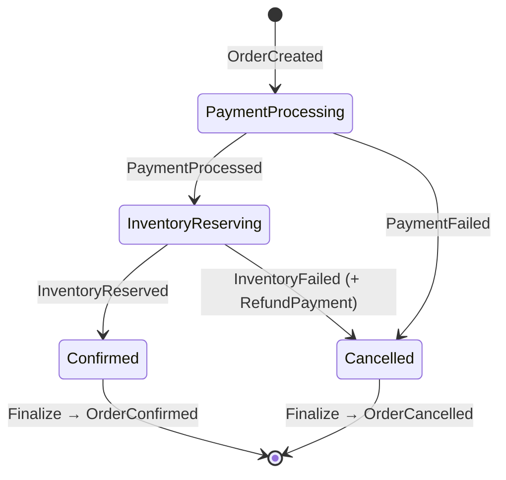

# MT Saga Order Processing

[]()
[]()
[]()
[]()
[]()
[]()
[]()

---

## Overview

This project demonstrates a distributed order processing system using the Saga pattern (Orchestration) with MassTransit on .NET 10.

The Saga coordinates the workflow between Order, Payment, and Inventory services using an event-driven architecture. Each step produces typed events, and the Saga ensures consistency using compensation logic when failures occur.

PostgreSQL persists the Saga state with xmin-based optimistic concurrency to prevent race conditions. Reliability is ensured through the Outbox pattern on worker services, retry policies with exponential backoff, and a kill switch for cascading failure protection.

The system is observable via OpenTelemetry and structured logging with correlation ID tracking across all service boundaries.

The goal was to build a system that is resilient, idempotent, and able to recover gracefully from failures — kept intentionally study-friendly without unnecessary layering.

---

## Monorepo Trade-off

Although implemented as a monorepo for simplicity, each service is logically isolated: independent `Program.cs`, independent consumer registration, and independent DI composition. They can be deployed independently with minimal changes.

---

## Key Features

- **Saga State Machine** — MassTransit `MassTransitStateMachine<OrderState>` with `SetCompletedWhenFinalized()`
- **EventContext envelope** — every bus message is `EventContext<TPayload>`, never raw types; carries `CorrelationId`, `CausationId`, `UserId`, `EventId`, `Version`, `Metadata`
- **Topology constants** — `OrderTopologyConstants` in `Contracts` (accessible by Saga without circular dependency); `OrderMessagingTopology` in `Infrastructure` delegates to it
- **Compensation logic** — InventoryFailed triggers RefundPayment + OrderCancelled; PaymentFailed triggers OrderCancelled directly
- **Outbox pattern** — EF Outbox + Bus Outbox on worker services only; Saga and OrderService publish directly (intentional — see Messaging Decisions)
- **Retry policies** — exponential backoff with configurable max attempts; kill switch on transient failures
- **Idempotent consumers** — workers are safe to re-deliver; projector is retry-only without inbox deduplication
- **FusionCache + Redis** — tag-based cache invalidation; Redis as L2 backplane
- **xmin optimistic concurrency** — for `OrderState` and `OrderReadModel` in PostgreSQL
- **CQRS-like pipeline** — `ValidationBehavior`, `CachingBehavior`, `CacheInvalidationBehavior`, `LoggingBehavior` as MediatR-style endpoint behaviors
- **Observability** — OpenTelemetry tracing and metrics; structured logging; CorrelationId propagation
- **Local orchestration** — .NET Aspire with resource graph (RabbitMQ, PostgreSQL, Redis, all services)
- **135 tests passing** — unit, integration, and E2E with Testcontainers; 0 failures, 0 warnings

---

## Architecture

### Happy Path



### Failure / Compensation Path



### State Machine



### Read Model Projection

All events (`OrderCreated`, `PaymentProcessed`, `InventoryReserved`, etc.) are projected by `OrderReadModelProjectorConsumer` into a denormalized `OrderReadModel` table with `FusionCache` invalidation per order tag.

---

## Solution Structure

```text
src/
├── MT.Saga.AppHost.Aspire/                  # Aspire app host — wires all services + infra
├── MT.Saga.AppHost.Aspire.ServiceDefaults/  # Shared OTEL/logging defaults (TraceContextEnricher)
├── MT.Saga.OrderProcessing.Contracts/       # Shared message contracts
│   ├── Commands/                            # ProcessPayment, ReserveInventory, RefundPayment
│   ├── Events/                              # OrderCreated, PaymentProcessed, InventoryReserved, …
│   ├── Messaging/
│   │   ├── EventContext.cs                  # Universal message envelope
│   │   ├── OrderTopologyConstants.cs        # String constants for Saga (no circular dep)
│   │   └── OrderQueueNames.cs
│   └── OrderStatuses.cs
├── MT.Saga.OrderProcessing.Infrastructure/  # Shared infrastructure
│   ├── Messaging/
│   │   ├── OrderMessagingTopology.cs        # Full topology (delegates to OrderTopologyConstants)
│   │   ├── Configuration/                   # MassTransit DI extensions, resilience, saga config
│   │   ├── Consumers/
│   │   │   └── OrderReadModelProjectorConsumer.cs
│   │   └── ConsumeContextAuditExtensions.cs
│   ├── Caching/                             # FusionCache + Redis setup
│   └── Persistence/                         # EF Core DbContext, xmin concurrency
├── MT.Saga.OrderProcessing.Saga/            # Saga state machine only
│   ├── OrderStateMachine.cs                 # Full orchestration logic
│   └── OrderState.cs
└── Services/
    ├── MT.Saga.OrderProcessing.OrderService/    # HTTP API (Minimal API, feature folders)
    │   ├── Features/Orders/
    │   │   ├── CreateOrder/                     # Command + Validator + Endpoint
    │   │   ├── GetOrderById/                    # Query + Validator + Endpoint
    │   │   └── GetOrders/                       # Query + Validator + Endpoint (paginated)
    │   └── Pipeline/                            # Validation, Caching, CacheInvalidation, Logging
    ├── MT.Saga.OrderProcessing.PaymentService/  # Worker
    │   └── Consumers/
    │       ├── ProcessPaymentConsumer.cs        # Publishes PaymentProcessed or PaymentFailed
    │       └── RefundPaymentConsumer.cs         # Fire-and-forget compensation log
    └── MT.Saga.OrderProcessing.InventoryService/  # Worker
        └── Consumers/
            └── ReserveInventoryConsumer.cs      # Publishes InventoryReserved or InventoryFailed

tests/
└── MT.Saga.OrderProcessing.Tests/
    ├── Caching/          # FusionCacheService, Redis options
    ├── Contracts/        # EventContext construction and envelope invariants
    ├── E2E/              # Full saga flow with Testcontainers (PostgreSQL, RabbitMQ, Redis)
    ├── Features/Orders/  # CreateOrder, GetOrderById, GetOrders validator tests
    ├── Infrastructure/   # Configuration, persistence, messaging infrastructure tests
    ├── Integration/      # Consumer integration tests (ProcessPayment, ReserveInventory, RefundPayment, OrderApi)
    ├── Pipeline/         # Behavior pipeline tests (caching, validation, logging)
    └── Services/         # ApplicationBuilder extension tests
```

---

## Test Coverage

**135 tests — 0 failures — 0 warnings**

| Category | What is tested |
|---|---|
| Unit — Saga state machine | All three terminal paths (confirm, compensate, cancel); saga finalization via `sagaHarness.NotExists` |
| Unit — Contracts | `EventContext<T>` construction, envelope fields, immutability |
| Unit — Pipeline behaviors | `ValidationBehavior`, `CachingBehavior`, `CacheInvalidationBehavior`, `LoggingBehavior` |
| Unit — Features | Command/query validators for all three order endpoints |
| Unit — Infrastructure | Messaging topology, resilience options, persistence configuration |
| Unit — Caching | `FusionCacheService` tag invalidation, Redis options binding |
| Integration — Consumers | `ProcessPaymentConsumer`, `ReserveInventoryConsumer`, `RefundPaymentConsumer` with `ITestHarness` and `IConsumerTestHarness<T>` |
| Integration — API | `OrderApiIntegrationTests` against full HTTP stack with `WaitForOrderReadModelStatusAsync` |
| E2E — Full saga | Testcontainers (PostgreSQL, RabbitMQ, Redis); happy path, payment failure, inventory failure compensation |

Tests use **xUnit v3**, **Shouldly**, `TestContext.Current.CancellationToken`, and MassTransit's `ISagaStateMachineTestHarness<TStateMachine, TState>`.

---

## Running Locally

Use the repository automation script (`dev.ps1`) for local workflow.

```powershell
pwsh ./dev.ps1 up       # Start infrastructure (via Aspire)
pwsh ./dev.ps1 build    # Build solution
pwsh ./dev.ps1 test     # Run all 135 tests
pwsh ./dev.ps1 down     # Stop infrastructure
```

Services (when running via Aspire):

- **Aspire Dashboard:** http://localhost:18888
- **Order Service API:** http://localhost:5000
- **RabbitMQ Management:** http://localhost:15672 (guest/guest)
- **PostgreSQL:** localhost:5432

---

## Trigger Flow

### Create an order

```http
POST /orders
Content-Type: application/json

{ "customerId": "...", "items": [...] }
```

This publishes `EventContext<OrderCreated>` to RabbitMQ, which the Saga consumes and orchestrates the full payment → inventory → confirmation flow.

---

## Messaging Architecture

### EventContext envelope

Every message on the bus is `EventContext<TPayload>` — never a raw type. This envelope carries:

```
SourceService | Entity | Action | Payload
CorrelationId | CausationId | EventId | UserId | IsAuthenticated | Version | Metadata
```

### Topology constants — why two places

`OrderTopologyConstants` lives in `Contracts` because the `Saga` project only references `Contracts` (not `Infrastructure`). Adding an `Infrastructure` reference to `Saga` would create a circular dependency. `OrderMessagingTopology` in `Infrastructure` delegates to these constants and adds queue names.

```
Saga → Contracts (OrderTopologyConstants)
Infrastructure → Contracts + Saga (OrderMessagingTopology delegates to OrderTopologyConstants)
Services → Infrastructure + Contracts
```

### Outbox placement

| Service | Outbox |
|---|---|
| OrderService | None — HTTP-originated events must dispatch immediately |
| Saga | None — saga commands must reach workers deterministically without DbContext |
| PaymentService | EF Outbox + Bus Outbox — transactional publish from within consumer |
| InventoryService | EF Outbox + Bus Outbox — transactional publish from within consumer |
| ReadModel Projector | None — retry-only; inbox deduplication would suppress re-projections |

### Command routing

Saga-to-worker commands use explicit queue URIs (`queue:orders.process-payment-queue`) rather than relying solely on `EndpointConvention`. `EndpointConvention` remains registered as a secondary mechanism.

### Producer interface rules

- **Events** → `IPublishEndpoint` in application code, `ConsumeContext.Publish` inside consumers
- **Commands** → `ISendEndpointProvider` in application code, `ConsumeContext.Send` inside consumers  
- **`IBus`** → avoid as default application dependency

For the detailed reference, see `docs/MASSTRANSIT_KB.md`.

---

## Observability

- **OpenTelemetry** — distributed tracing and metrics across all services
- **Structured logging** — Serilog-compatible; `{OrderId}`, `{CorrelationId}`, `{ConversationId}` in all log entries
- **CorrelationId propagation** — from HTTP request → `EventContext` envelope → MassTransit transport headers → all downstream consumers
- **Aspire Dashboard** — local trace viewer, metrics, logs aggregation

---

## Design Decisions

- **Monorepo** — simplicity for a study project; each service is independently deployable
- **Single PostgreSQL database** — shared schema; in production each service would own its schema
- **Orchestration over choreography** — centralized Saga is easier to reason about and test
- **DDD-light** — pragmatic feature folders, no heavy layering, no separate application/domain/infrastructure packages per service
- **`TreatWarningsAsErrors=true`** — enforced at solution level
- **Central Package Management** — all NuGet versions in `Directory.Packages.props`

---

## Key Principles

- Failures are expected — design for retry-safety from the start
- Idempotency is mandatory — every consumer can receive the same message more than once
- Eventual consistency over distributed transactions
- Observable by default — correlation IDs in every log line and trace
- Test the real thing — E2E tests use real containers, not mocks of RabbitMQ or PostgreSQL

---

## How To Explain This Project

> This project demonstrates Saga-based orchestration using MassTransit on .NET 10.
>
> It coordinates distributed services (Order, Payment, Inventory) and ensures consistency using compensation logic when failures occur.
>
> PostgreSQL persists the Saga state with optimistic concurrency. The Outbox pattern on worker services guarantees at-least-once delivery. FusionCache with Redis provides low-latency reads with tag-based invalidation.
>
> The system is observable via OpenTelemetry, resilient via retry and kill switch policies, and fully covered by 135 tests across unit, integration, and E2E layers using Testcontainers.

---

## Future Improvements

- **CI/CD pipeline** — GitHub Actions: build, test, Docker image publish
- **Architecture tests** — ArchUnitNET to enforce that `Saga` never references `Infrastructure`; layer dependency rules as executable specs
- **Health check endpoints** — `/health/live` and `/health/ready` per service with RabbitMQ, PostgreSQL, Redis probes
- **API versioning** — `/v1/orders` with `Asp.Versioning`
- **Authentication** — JWT bearer validation; `IsAuthenticated` and `UserId` already propagate through `EventContext`
- **Azure Service Bus support** — swap RabbitMQ transport without changing business logic
- **OpenTelemetry exporter** — Jaeger or Grafana Tempo for persistent trace storage
- **Real worker implementations** — replace header-based simulation in `ProcessPaymentConsumer` and `ReserveInventoryConsumer` with actual service calls
- **Per-service test assemblies** — split the single test project into `Tests.Unit`, `Tests.Integration`, `Tests.E2E` for faster feedback loops
- **Multi-database architecture** — each service owns its schema; separate connection strings per service
- **Saga timeout / expiry** — schedule a `TimeoutExpired` event if OrderConfirmed is not reached within N minutes

---

## Documentation Index

| File | Content |
|---|---|
| `README.md` | This file — architecture, setup, design decisions |
| `docs/MASSTRANSIT_KB.md` | Detailed MassTransit knowledge base (600+ lines, 28 sources) |
| `docs/REFACTORING_STATUS.md` | Configuration refactoring history and validation checklist |
| `docs/REFACTORING_PLAN.md` | Original refactoring plan and phase roadmap |
| `.github/copilot-instructions.md` | AI assistant instructions for this repo |
| `.github/agents/` | Specialized AI agent definitions (architecture guardian, test reviewer, etc.) |
